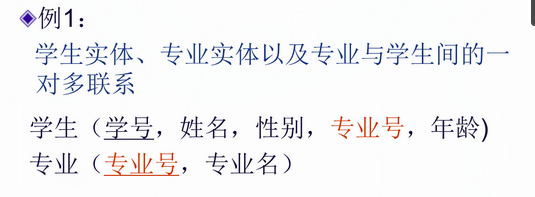
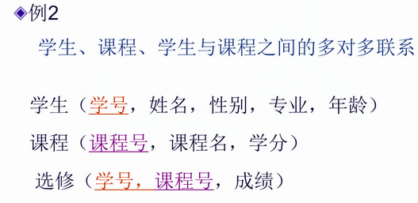

## 候选码

```
能够被选为主码的属性或属性组，说明主码不唯一
```

## 主属性

> 定义：包含在任何候选码中的属性(主码一定是候选码，候选码不一定是主码，因为主码是人选的，是随机的)
> 例：比如，竞赛表（竞赛编号，竞赛名称，竞赛组织者） PS：竞赛名称和竞赛组织者都可以重复

> 很明显可以看出竞赛编号能够唯一标识整张竞赛表，因此候选码是竞赛编号，并且仅此一个候选码，其他属性都不能唯一标识整张表，所竞赛编号同时也是主码。

> 这时候判断一下这几个属性 or 属性组是否是主属性，（竞赛编号）（竞赛编号，竞赛名称）（竞赛名称，竞赛组织者），（竞赛编号）只有一个属性，这个属性是主码，主码必定为候选码，因此属性含有一个候选码，这个属性是主属性。（竞赛编号，竞赛名称）有两个属性，其中竞赛编号是候选码，而竞赛名称不是候选码，那他是啥呢~前面有提到了，因为它跟候选码在同一个属性组里，所以，竞赛名称是超码，回过头来，最后得出该属性组含有了一个候选码，因此该属性组中的各个属性都是主属性。（竞赛名称，竞赛组织者）有两个属性，可以看出这两个属性都不是候选码，因此这个属性组不包含候选码，属性组中中得各个元素称为非主属性。

## misc

```
主码=主键=主关键字，关键字=候选码 候选关键字=候选码中除去主码的其他候选码
```

## 元组

```
表中的每行（即数据库中的每条记录）就是一个元组;元组的个数为基数
```

## 目（度）

```
属性个数，也即列数
```

## 关系模型中的三类完整性约束

```
1. 实体完整性
2. 参照完整性
3. 用户定义完整性
```

## 实体完整性

```
实体完整性规则规定基本关系的所有主属性不能取空值，当我给某个表设置主键时，由于给主属性设置了空值，始终创建不了主码
```

## 参照完整性

```
在关系模型中实体与实体之间的联系都是用关系来描述的，因此存在关系与关系之间的引用
```

>  \
>  \
> 

> > _外码_ \
> > `设F是基本关系R中的一个或一组属性，但不是关系R的码。如果F与基本关系S中的主码K相对应，那么F是基本关系R的外码（外码取值可取空值，因为不是主属性;外码可取S中某个元组的主码值）` \
> > _参照关系_ \
> > `外码所在的关系，即关系R为参照关系` \
> > _被参照关系(目标关系)_ \
> > `关系S为参照关系`

> > 例 1\
> > 外码：专业&ensp;&ensp;&ensp;&ensp;参照关系:学生关系&ensp;&ensp;&ensp;&ensp;被参照关系：专业关系\
> > 例 2\
> > 外码：学号、课程号&ensp;&ensp;&ensp;&ensp;参照关系:选修&ensp;&ensp;&ensp;&ensp;被参照关系：学生关系、课程关系\
> > 例 3\
> > 外码：班长&ensp;&ensp;&ensp;&ensp;参照关系:学生关系&ensp;&ensp;&ensp;&ensp;被参照关系：学生关系

## 用户定义完整性

```
例：课程(课程号，课程名，学分) 主码为课程号
- “课程名”属性必须取唯一值
- 非主属性“课程名”不能取空值
- “学分”属性只能取值{1,2,3,4}
```

## 关系代数运算的分类

```
1.传统的集合运算：并、交、差、广义笛卡尔积
2.专门的关系运算：选择、投影、连接、除
```
