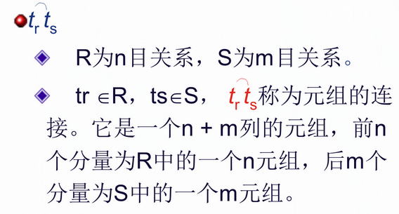
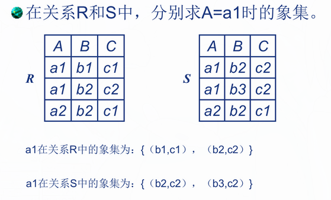
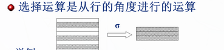
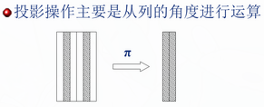
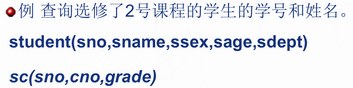
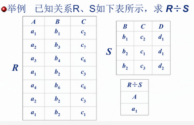
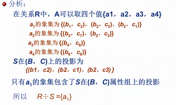

| 运算符 |   含义   |
| :----: | :------: |
|   ∪    |    并    |
|   -    |    差    |
|   ∩    |    交    |
|   ×    | 笛卡尔积 |
|   σ    |   选择   |
|   π    |   投影   |
|   ⋈    |   连接   |
|   ÷    |    除    |

## 专门的关系运算

```
选择、投影、连接、除
```

## 记号

> R, t∈ R, t[A<sub>i</sub>]
>
> - 设关系模式为 R(A<sub>1</sub>,A<sub>2</sub>,……,A<sub>n</sub>)
> - t∈ R 表示 t 是 R 的一个元组
> - t[A<sub>i</sub>]表示元组 t 中对应属性 A<sub>i</sub>的一个分量(单元格的值)

> A, t[A], $\overline{A}$
> 若 A={A<sub>i1</sub>,A<sub>i2</sub>,……,A<sub>ik</sub>}
>
> - 其中 A 称为属性列或者域列
> - t[A]=([t[A<sub>i1</sub>],t[A<sub>i2</sub>],……,t[A<sub>ik</sub>])表示元组 t 在属性列 A 上诸分量的集合
> - $\overline{A}$表示{A<sub>1</sub>,A<sub>2</sub>,……,A<sub>n</sub>}中去掉{A<sub>i1</sub>,A<sub>i2</sub>,……,A<sub>ik</sub>}后剩余的属性列
>
> \
> 象集\
> 

## 选择

> 
> |Sno|Sname|Ssex|Sage|Sdept|
> |---|---|---|---|---|
> |201215122|刘晨|女|19|IS|
> |201215125|张立|男|19|IS|
> |201215122|王敏|女|19|MA|
> |201215122|李勇|男|19|CS|
> |201215122|大地|男|20|IS|
>
> 例 1 查询信息系（IS）全体学生的信息\
> **σ<sub>Sdept='IS'</sub><sup>(Student)</sup>** (字符串使用单引号)
> |Sno|Sname|Ssex|Sage|Sdept|
> |---|---|---|---|---|
> |201215122|刘晨|女|19|IS|
> |201215125|张立|男|19|IS|
> |201215122|大地|男|20|IS|

> 例 2 查询**信息系**年龄**小于 20**的学生信息\
> **σ<sub>Sdept='IS'</sub>∧<sub>Sage<20</sub><sup>(Student)</sup>**
> |Sno|Sname|Ssex|Sage|Sdept|
> |---|---|---|---|---|
> |201215122|刘晨|女|19|IS|
> |201215125|张立|男|19|IS|

## 投影

> 
>
> _投影后不仅取消了原关系中的某些列，而且还可能取消某些元组(避免重复行)_\
>  例 3 求 Student 关系学生姓名和所在系两个属性上的投影：\
>  **π<sub>Sname,Sdept</sub><sup>(Student)</sup>**
> |Sname|Sdept|
> |---|---|
> |刘晨|IS|
> |张立|IS|
> |王敏|MA|
> |李勇|CS|
> |大地|IS|

> 例 4 查询学生关系 Student 中都有哪些系？(涉及去重)
>
> **π<sub>Sdept</sub><sup>(Student)</sup>**
> |Sdept|
> |---|
> |MA|
> |CS|
> |IS|
>
> 思考：查询信息系年龄<20 岁的学生学号、姓名、年龄？\
> **π<sub>Sno,Sname,Sage</sub><sup>(σ<sub>Sdept='IS'</sub>∧<sub>Sage<20</sub><sup>(Student)</sup>)</sup>**

## 连接(join)

> **1.普通连接**
>
> 关系 R
> |A|B|C|
> |:---:|:---:|:---:|
> |a1|b1|5|
> |a1|b2|6|
> |a2|b3|8|
> |a2|b4|12|
>
> 关系 S
> |B|E|
> |:---:|:---:|
> |b1|3|
> |b2|7|
> |b3|10|
> |b3|2|
> |b5|2|
>
> \
> 两关系做笛卡尔积后结果为
> |A|R.B|C|S.B|E|
> |:---:|:---:|:---:|:---:|:---:|
> |a1|b1|5|b1|3|
> |a1|b1|5|b2|7|
> |a1|b1|5|b3|10|
> |a1|b1|5|b3|2|
> |a1|b1|5|b5|2|
> |a1|b2|6|b1|3|
> |a1|b2|6|b2|7|
> |a1|b2|6|b3|10|
> |a1|b2|6|b3|2|
> |a1|b2|6|b2|2|
> |a2|b3|8|b1|3|
> |a2|b3|8|b2|7|
> |a2|b3|8|b3|10|
> |a2|b3|8|b3|2|
> |a2|b3|8|b5|2|
> |a2|b4|12|b1|3|
> |a2|b2|12|b2|7|
> |a2|b2|12|b3|10|
> |a2|b2|12|b3|2|
> |a2|b2|12|b5|2|
>
> 根据**C<E**,筛选后得
> |A|R.B|C|S.B|E|
> |:---:|:---:|:---:|:---:|:---:|
> |a1|b1|5|b2|7|
> |a1|b1|5|b3|10|
> |a1|b2|6|b2|7|
> |a1|b2|6|b3|10|
> |a2|b3|8|b3|10|
>
> **2.等值连接**\
> 
>
> |  A  | R.B |  C  | S.B |  E  |
> | :-: | :-: | :-: | :-: | :-: |
> | a1  | b1  |  5  | b1  |  3  |
> | a1  | b2  |  6  | b2  |  7  |
> | a1  | b2  |  6  | b2  |  2  |
> | a2  | b3  |  8  | b3  | 10  |
> | a2  | b3  |  8  | b3  |  2  |
> | a2  | b2  | 12  | b2  |  7  |
>
> **3.自然连接**\
> `是一种特殊的等值连接`\
> 
>
> |  A  |  B  |  C  |  E  |
> | :-: | :-: | :-: | :-: |
> | a1  | b1  |  5  |  3  |
> | a1  | b2  |  6  |  7  |
> | a1  | b2  |  6  |  2  |
> | a2  | b3  |  8  | 10  |
> | a2  | b3  |  8  |  2  |
> | a2  | b2  | 12  |  7  |
>
> > **自然连接与等值连接区别:**
> >
> > 1.  等值连接中不要求相等属性值的属性名相同，而自然连接要求相等属性值的属性名必须相同，即两关系只有在同名属性才能进行自然连接。如上例 R 中的 C 列和 S 中的 E 列可进行等值连接，但因为属性名不同，不能进行自然连接。
> > 2.  等值连接不将重复属性去掉，而自然连接去掉重复属性，也可以说，自然连接是去掉重复列的等值连接。如上例 R 中的 B 列和 S 中的 B 列进行等值连接时，结果有两个重复的属性列 B,而进行自然连接时，结果只有一个属性列 B

## 选择、投影、(自然)连接综合例题

> \
> **π<sub>sno,sname</sub><sup>(σ<sub>cno='2'</sub></sub><sup>(student⋈sc)</sup>)</sup>**

## 除

>  
